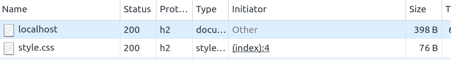
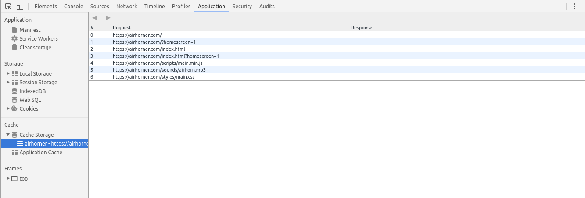

# Codelab Progressive Webapp

## Prérequis

Pour faire ce codelab, vous avez besoin des outils suivants : 

* GIT
* NodeJS 7.x
* Google Chrome
* Un IDE

## PW1 - Auditer votre application

Avant d'implémenter les fonctionnalités permettant de rendre une application compatible **Progressive Webapp**, il est intéressant
tout d'abord de faire un petit audit de l'existant. Nous allons éviter de le faire à la main, mais nous allons plutôt utiliser l'outil
**Lighthouse**, développé par l'équipe Chrome. 

Cet outil peut soit être utilisé via une extension Chrome, ou en ligne de commande via un module **NPM**. Nous allons utiliser cette dernière 
solution. 

* Installez le module `lighthouse` via `NPM`

```shell
npm i -g lighthouse
```

Vous pouvez maintenant auditer l'application que nous vous proposons. 

* Lancez l'application

```shell
npm install
node server.js
```

* Lancez **LightHouse**

```shell
lighthouse http://localhost:3003/
```

L'outil doit normalement vous retourner un rapport d'audit directement dans la console. 
Nous allons essayer de corriger tous ces problèmes lors ce codelab. Un rapport HTML doit 
normalement être généré. 

* Notez la note initiale retournée par **LightHouse**. Elle doit normalement être égale à 34%.


## PW2 - Manifest

Vous pouvez à présent vérifier le nouveau score calculé par **LightHouse**

## PW3 - Mise en place de Http2

La première optimisation que nous allons mettre en place est l'utilisation d'HTTP2 sur notre 
serveur. Le serveur que nous vous proposons est un serveur Express (NodeJS), mais ne supporte
pour l'instant que HTTP. 

Nous allons donc intégrer le module `NodeJS` **spdy**  afin de gérer cette nouvelle version du protocole. 
Nous vous conseillons de faire les modifications en deux étapes : 

- Rendre accessible votre site que en HTTP2
- Utilisation la fonctionnalité de **Server Push** pour envoyer les ressources statiques de votre site à votre client

### Site accessible en HTTP2

* Générer les différents certificats

```shell
openssl genrsa -des3 -passout pass:x -out server.pass.key 2048
openssl rsa -passin pass:x -in server.pass.key -out server.key
rm server.pass.key
openssl req -new -key server.key -out server.csr
openssl x509 -req -sha256 -days 365 -in server.csr -signkey
```

* Dans le fichier server.js, stocker le contenu des fichier `server.key` et `server.crt` dans  deux variables. 

* Installer le module `spdy`

* Instancier votre serveur grâce au module précédemment téléchargé. 

```javascript
require('spdy').createServer(options, app).listen(port);
```

La variable `app` correspond à à votre instance `express` et `options` à un objet de configuration dans lequel vous allez utiliser 
les certificats récupérés précédemment. 

```javascript
const options = {
    key: fs.readFileSync('./server.key'),
    cert: fs.readFileSync('./server.crt')
};
```

Pour vérifier que votre serveur utilise à présent `http2`, vous pouvez vérifier dans les `DevTools` de Chrome. Dans le protocole utilisé pour chaque requête, vous devriez voir `https`



Vous pouvez également vérifier l'onglet **Security** pour vérifier que votre certificat a bien été pris en compte. 

### ServerPush

La dernière optimisation que nous allons mettre en place est l'utilisation de la fonctionnalité de ServerPush. Cette 
fonctionnalité permet au serveur d'envoyer des ressources statiques avant que le navigateur le demande. Cette fonctionnalité
sera utilisée pour servir les ressources statiques de notre application, situées dans le répertoire `app/assets`. 

* Supprimer l'utilisation du middleware Express `static` qui nous sera à présent inutile. 
* Dans le handler principal de votre serveur, utilisez la méthode `push` de la réponse HTTP afin de retourner le contenu d'un fichier. 
La signature de cette méthode ressemble à : 

```
res.push('url vers votre ressource statique utilisée dans l'html', {
    response: {
        'content-type': 'content-type associé à la ressource statique manipulée'
    }
})
.end(contenu de votre ressources statique)
```

Vous devez servir ainsi les fichiers suivants : 
* le script javascript (`application/javascript`)
* la feuille de style (`text/css`)
* les fonts (`font/woff` et `font/woff2`)
* les images principales (`image/svg+xml`)

Si vous vérifier de nouveau l'onglet **Network** de la console Chrome, certaines requêtes 
doivent à présent être initiées par un **Push** du serveur.

Votre serveur utilise à présent le procole `http2` pour servir votre application. 

Vous pouvez à présent vérifier le nouveau score calculé par **LightHouse**

## PW4 - Service Worker - AppShell

Nous allons à présent mettre en place notre premier service worker 
afin de mettre en cache l'AppShell de notre application. 

A partir de ce PW, nous allons utiliser la version HTTP de notre serveur. En effet, 
les service worker ne peuvent normalement être actifs que si ils sont servis via HTTPs. Mais 
Chrome, sans aucune configuration, les active en HTTP pour les serveurs en `localhost`.

* En JavaScript, ajoutez la classe `off` à l'élément `#wrapper` si l'utiliseur est hors ligne. 

* Dans le fichier `index.html`, si votre navigateur supporte les service workers, enregistrer le service worker `sw.js`.

* Dans la phase `install`, mettre dans un cache **codelab-1**, les fichiers de votre application nécessaire pour faire l'AppShell ('/', le fichier javascript, la feuille de style, les font et les images principals)

* Implémentez le `fetch` event pour retourner la version qui est en cache, et si elle n'existe pas, exécutez réélement la requête. 

* Dans la phase `activate`, veuillez supprimer les caches qui ne sont plus utiliser (dont le nom est différent que celui utilisé dans la version actuelle de votre service worker)

* Testez votre application. Après plusieurs rafraichissement, dans l'onglet `network`, vos ressources statiques seront servies par le service worker, et non plus via le réseau. 

Pour émuler le mode offline, vous pouvez le faire via les **DevTools** de Chrome. 
* Cliquez sur l'onglet **Network**
* Activez / Désactivez l'option **Offline**

Pour pouvoir débugger le **cache** de votre navigateur, vous pouvez utiliser les **DevTools**
de Chrome, et notamment la partie **Cache** de l'onglet **Application**



## PW5 - Service Worker - IndexedDB

## PW6 - Service Worker - Background Sync

## PW7 - Service Worker - SW Toolbox

## PW8 - Service Worker - SW Precache
